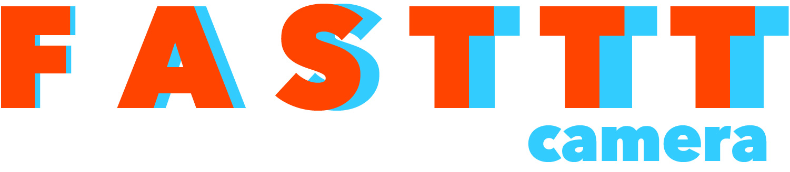
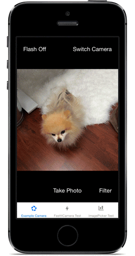

[](http://ifttt.github.io)



[](https://travis-ci.org/IFTTT/FastttCamera) [](https://coveralls.io/r/IFTTT/FastttCamera)

`FastttCamera` is a wrapper around `AVFoundation` that allows you to build your own powerful custom camera app without all the headaches of using `AVFoundation` directly.

`FastttCamera` now [supports awesome photo filters](#filters)!



`FastttCamera` powers the camera in the new [Do Camera](https://ifttt.com/products/do/camera) app for iOS from [IFTTT](https://ifttt.com/wtf).

[](https://itunes.apple.com/us/app/do-camera-by-ifttt/id905998167)

#### Major headaches that `FastttCamera` automatically handles for you:

##### `AVFoundation` Headaches
* Configuring and managing an `AVCaptureSession`.
* Displaying the `AVCaptureVideoPreviewLayer` in a sane way relative to your camera's view.
* Configuring the state of the `AVCaptureDevice` and safely changing its properties as needed, such as setting the flash mode and switching between the front and back cameras.
* Adjusting the camera's focus and exposure in response to tap gestures.
* Zooming the camera in response to pinch gestures.
* Capturing a full-resolution photo from the `AVCaptureStillImageOutput`.

##### Device Orientation Headaches
* Changing the `AVCaptureConnection`'s orientation appropriately when the device is rotated.
* Detecting the actual orientation of the device when a photo is taken _even if orientation lock is on_ by using the accelerometer, so that landscape photos are always rotated correctly.
* _(Optional)_ Returning a preview version of the image rotated to match the orientation of what was displayed by the camera preview, even if the user has orientation lock on.
* _(Optional)_ Asynchronously returning an orientation-normalized version of the captured image rotated so that the image orientation is always UIImageOrientationUp, useful for reliably displaying images correctly on web services that might not respect EXIF image orientation tags.

##### Image Processing Headaches
* _(Optional)_ Cropping the captured image to the visible bounds of your camera's view.
* _(Optional)_ Returning a scaled-down version of the captured image.
* Processing high-resolution images quickly and efficiently without overloading the device's memory or creating app-terminating memory leaks.


`FastttCamera` does many operations faster than `UIImagePickerController`'s camera, such as switching between the front and back camera, and provides you the captured photos in the format you need, returning a cropped full-resolution image as quickly as `UIImagePickerController` returns the raw captured image on most devices. It allows all of the flexibility of `AVFoundation` without the need to reinvent the wheel, so you can focus on making a beautiful custom UI and doing awesome things with photos.

While both `UIImagePickerController`'s camera and `AVFoundation` give you raw images that may not even be cropped the same as the live camera preview your users see, `FastttCamera` gives you a full-resolution image cropped to the same aspect ratio as your live preview's viewport as well as a preview image scaled to the pixel dimensions of that viewport, whether you want a square camera, a camera sized to the full screen, or something else.

`FastttCamera` also is smart at handling image orientation, a notoriously tricky part of images from both `AVFoundation` and `UIImagePickerController`. The orientation of the camera is magically detected correctly even if the user is taking landscape photos with orientation lock turned on, because `FastttCamera` checks the accelerometer to determine the real device orientation.

## Installation

FastttCamera is available through [CocoaPods](http://cocoapods.org). To install
it, simply add the following line to your `Podfile`:

```
pod "FastttCamera"
```

## Example Project

To run the example project, clone the repo, and run `pod install` from the `Example` directory.

## Usage

Add an instance of `FastttCamera` as a child of your view controller. Adjust the size and layout of `FastttCamera`'s view however you'd like, and `FastttCamera` will automatically adjust the camera's preview window and crop captured images to match what is visible within its bounds.

```objc
#import "ExampleViewController.h"
#import <FastttCamera.h>

@interface ExampleViewController () <FastttCameraDelegate>
@property (nonatomic, strong) FastttCamera *fastCamera;
@end

@implementation ExampleViewController

- (void)viewDidLoad
{
    [super viewDidLoad];
    _fastCamera = [FastttCamera new];
    self.fastCamera.delegate = self;
    
    [self fastttAddChildViewController:self.fastCamera];
    self.fastCamera.view.frame = self.view.frame;
}
```
Switch between the front and back cameras.

```objc
if ([FastttCamera isCameraDeviceAvailable:cameraDevice]) {
	[self.fastCamera setCameraDevice:cameraDevice];
}
```
Set the camera's flash mode.

```objc
if ([FastttCamera isFlashAvailableForCameraDevice:self.fastCamera.cameraDevice]) {
	[self.fastCamera setCameraFlashMode:flashMode];
}
```

Set the camera's torch mode.

```objc
if ([FastttCamera isTorchAvailableForCameraDevice:self.fastCamera.cameraDevice]) {
	[self.fastCamera setCameraTorchMode:torchMode];
}
```
Tell `FastttCamera` to take a photo.

```objc
[self.fastCamera takePicture];
```
Use `FastttCamera`'s delegate methods to retrieve the captured image object after taking a photo.

```objc
#pragma mark - IFTTTFastttCameraDelegate

- (void)cameraController:(FastttCamera *)cameraController
 didFinishCapturingImage:(FastttCapturedImage *)capturedImage
{
	/**
 	*  Here, capturedImage.fullImage contains the full-resolution captured
 	*  image, while capturedImage.rotatedPreviewImage contains the full-resolution
 	*  image with its rotation adjusted to match the orientation in which the
 	*  image was captured.
 	*/
}

- (void)cameraController:(FastttCamera *)cameraController
 didFinishScalingCapturedImage:(FastttCapturedImage *)capturedImage
{
	/**
 	*  Here, capturedImage.scaledImage contains the scaled-down version
 	*  of the image.
 	*/
}

- (void)cameraController:(FastttCamera *)cameraController
 didFinishNormalizingCapturedImage:(FastttCapturedImage *)capturedImage
{
	/**
 	*  Here, capturedImage.fullImage and capturedImage.scaledImage have
 	*  been rotated so that they have image orientations equal to
 	*  UIImageOrientationUp. These images are ready for saving and uploading,
 	*  as they should be rendered more consistently across different web
 	*  services than images with non-standard orientations.
 	*/
}
```

# Filters!

`FastttCamera` now supports awesome photo filters! 

## Filter Camera

`FastttFilterCamera` is a wrapper around the super-speedy [`GPUImage`](https://github.com/BradLarson/GPUImage) project that supports fast and easy creation of a camera app using filters based on [`GPUImage`](https://github.com/BradLarson/GPUImage)'s Lookup Filters.

[`GPUImage`](https://github.com/BradLarson/GPUImage) is a powerful framework that processes images by using the GPU so quickly that it's possible to filter the live video preview straight from the camera. With all of its powerful features, it can be a bit tricky to get it configured correctly to make this work, and then you still need to solve the same image orientation and cropping challenges that you would using `AVFoundation`. `FastttFilterCamera` uses the same interface as `FastttCamera`, but allows you to apply a simple filter to the camera's preview or to your images.

## Lookup Filters

Lookup Filters are a clever feature of [`GPUImage`](https://github.com/BradLarson/GPUImage) that makes creating beautiful filters as easy as editing a photo. Using your favorite photo editing application, you create whatever effect you want using actions or layers, and test it out on photos until you like the look. If you use Photoshop, check out [this example lookup filter image creation file](https://github.com/IFTTT/FastttCamera/raw/master/Docs/example-lookup-image-creation.psd).

When you're ready, you take a [special png image](https://raw.githubusercontent.com/IFTTT/FastttCamera/master/Docs/lookup.png) that has one pixel for each possible color value, and apply your desired effects to it. The Lookup Filter then filters each pixel of a photo by looking at the pixel location in your lookup image that corresponds to the color in the photo, and replacing it with the color it finds in the lookup image.

It's super fast because it doesn't need to do any on-the-fly calculations such as adjusting contrast or brightness, it just looks up the pre-calculated replacement color, so you can do more complex effects without slowing down your app. Pretty cool stuff!

The only limitation of Lookup Filters is that the effects you apply must not be affected by the location of the pixel. Blur, vignette, noise/grain, texture, edge detection, and other similar effects that are either dependent on neighboring pixels or aren't uniform over the entire image won't work, but Contrast, Levels, Color Overlay, Hue, Brightness, and Saturation would all be perfect effects to use here. Remember to save it as an uncompressed 512 x 512 png image when you're done.


## Filters Installation

`FastttCamera` uses a [CocoaPods](http://cocoapods.org) subspec if you need support for photo filtering. To install `FastttCamera` including filters support, simply add the following line to your `Podfile`:

```
pod "FastttCamera/Filters"
```
This will also include all of the standard `FastttCamera` classes, so the `FastttCamera/Filters` subspec is the only `FastttCamera` [CocoaPod](http://cocoapods.org) you need to include in your `Podfile`.

## Usage

The filters camera uses the same interface as the regular `FastttCamera`. To create a camera that live-filters the camera's preview, just include the Filters 
[CocoaPods](http://cocoapods.org) subspec, and create a `FastttFilterCamera` instead of a `FastttCamera`.

```objc
#import "ExampleViewController.h"
#import <FastttFilterCamera.h>

@interface ExampleViewController () <FastttCameraDelegate>
@property (nonatomic, strong) FastttFilterCamera *fastCamera;
@end

@implementation ExampleViewController

- (void)viewDidLoad
{
    [super viewDidLoad];
    UIImage *lookupFilterImage = [UIImage imageNamed:@"YourLookupImage"];
    _fastCamera = [FastttFilterCamera cameraWithFilterImage:lookupFilterImage];
    self.fastCamera.delegate = self;
    
    [self fastttAddChildViewController:self.fastCamera];
    self.fastCamera.view.frame = self.view.frame;
}
```

To change to a different filter, just change the `filterImage` property of the `FastttFilterCamera` to the lookup image of the new filter.

```objc
- (void)switchFilter
{    
    UIImage *newLookupFilterImage = [UIImage imageNamed:@"NewLookupImage"];
    self.fastCamera.filterImage = newLookupFilterImage;
}
```

## Filtering Captured Photos

If you don't want the live camera preview to have a set filter, you can use a regular `FastttCamera` for photo taking, then apply your filters to the captured photos afterwards.

Include the `FastttCamera/Filters` [CocoaPods](http://cocoapods.org) subspec, then create a regular `FastttCamera` for photo capturing. After your user takes the photo, you can present filter options they can apply to the static image on your photo edit/confirm screen using the `UIImage` `fastttFilteredWithImage:` filter method found in `UIImage+FastttFilters.h`.

```objc
#import <UIImage+FastttFilters.h>

- (void)applyFilter
{
    UIImage *preview = [UIImage imageWithContentsOfFile:self.imageFileName];
    UIImage *lookupFilterImage = [UIImage imageNamed:@"LookupImage"];
    preview = [preview fastttFilteredImageWithFilter:lookupFilterImage];
    [self.imageView setImage:preview];
}
```

Remember to apply each filter to the original `UIImage` if you let users switch between many filters, instead of applying new filters on top of the same image you already filtered, unless you intend for the filters' effects to be combined.

## Filters Example Project

To run the filters example project, clone the repo, and run `pod install` from the `FiltersExample` directory.

You can see a few examples of different lookup images used for filtering in the `Images.xcassets` directory. [Remember](#lookup-filters), to make your own custom lookup filters, start with [this unfiltered lookup image](https://raw.githubusercontent.com/IFTTT/FastttCamera/master/Docs/lookup.png), and remember to save it as an uncompressed 512 x 512 png image in your project when you're done applying any desired effects.

## Contributors

* [Laura Skelton](https://github.com/lauraskelton), creator.
* [Jonathan Hersh](https://github.com/jhersh), feedback and code review.

## License

FastttCamera is available under the MIT license. See the LICENSE file for more info.

Copyright 2015 IFTTT Inc.
